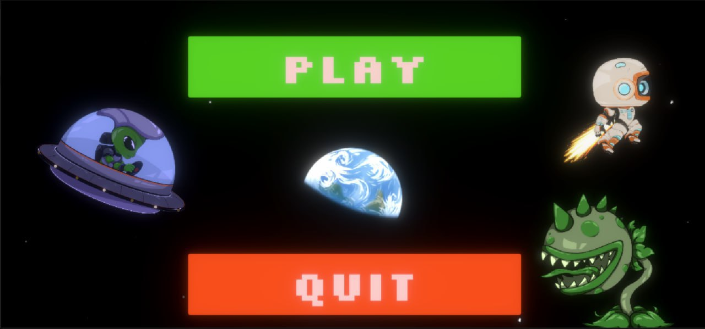
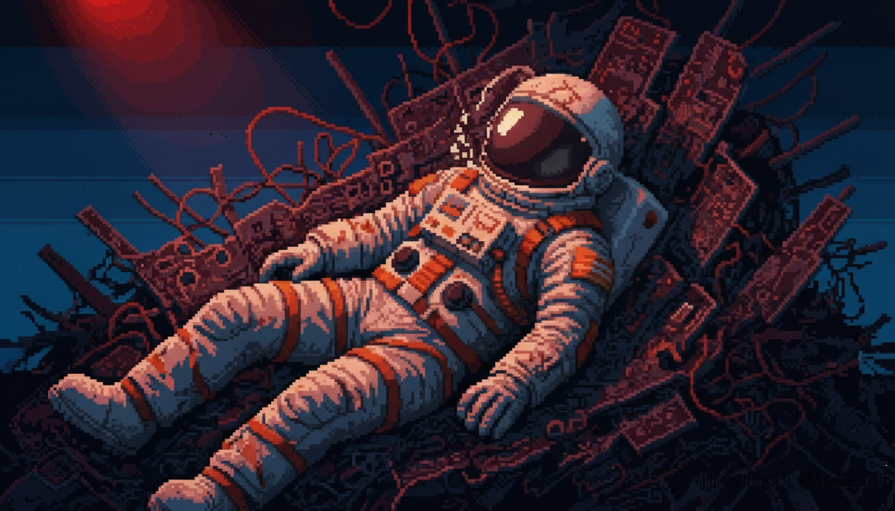

# 🚀 Moonfall - Last Horizon


## 🌌 Overview / Огляд



English: Moonfall - Last Horizon is an epic sci-fi adventure game set in a post-apocalyptic space station. Players take on the role of Captain Orion, the last commander of station "Astra-5", fighting against alien invaders to save humanity.

Українська: Moonfall - Last Horizon - це епічна науково-фантастична пригодницька гра, що розгортається на пост-апокаліптичній космічній станції. Гравці виступають в ролі Капітана Оріона, останнього командира станції "Astra-5", який бореться з інопланетними загарбниками, щоб врятувати людство.

## 📖 Storyline / Сюжет



### English
Earth is exhausted by catastrophes, humanity is on the brink of extinction seeking refuge on the moon. Captain Orion is the last hope to find energy for a global shield or relocation. His journey takes him through:
- Asteroid Field - searching for resources
- Station Underbelly - discovering the truth about aliens
- Lunar Surface - making the final choice to save humanity

### Українська
Земля виснажена катастрофами, людство на межі вимирання шукає притулок на Місяці. Капітан Оріон - остання надія знайти енергію для глобального щита чи переселення. Його шлях пролягає через:
- Астероїдне поле - пошук ресурсів
- Підземелля станції - відкриття правди про інопланетян
- Поверхню Місяця - фінальний вибір для порятунку людства

## 🎮 Game Features / Особливості гри

### English
- 🪐 3 Unique Locations: Asteroid field, station underbelly, lunar surface
- 👾 Alien Enemies: Various types of Xyrian invaders
- 🔧 Puzzle Solving: Energy module activation and system restoration
- 🎯 Multiple Endings: 3 different endings based on player choices

### Українська
- 🪐 3 Унікальні локації: Астероїдне поле, підземелля станції, поверхня Місяця
- 👾 Інопланетні вороги: Різноманітні типи загарбників Ксирії
- 🔧 Головоломки: Активація енергетичних модулів та відновлення систем
- 🎯 Кілька кінцівок: 3 різні кінцівки залежно від вибору гравця

## 🗂 Project Structure / Структура проєкту
```
Unity-Game/
├── Assets/
│   ├── Scripts/           # Game scripts
│   ├── Scenes/           # Game scenes
│   ├── Prefabs/          # Prefabricated objects
│   ├── Sprites/          # 2D graphics and UI
│   ├── Audio/            # Sound effects and music
│   └── Materials/        # Shaders and materials
├── Packages/             # Unity packages
├── ProjectSettings/      # Unity project settings
└── README.md            # This file
```

## 🛠 Installation & Setup / Встановлення та налаштування

### English

#### Prerequisites / Передумови
- Unity 2022.3 LTS or newer
- Git installed on your system

#### Steps / Кроки
1. Clone the repository:
      ```
      git clone https://github.com/DeKlain4ik/Unity-Game.git
      ```
   

2. Open in Unity:
   - Launch Unity Hub
   - Add project from disk
   - Select the cloned folder

3. Configure build settings:
   - Open File → Build Settings
   - Add required scenes to build
   - Select target platform

4. Run the game:
   - Press Play in Unity Editor
   - Or build executable file

### Українська

#### Передумови
- Unity 2022.3 LTS або новіша версія
- Встановлена система Git

#### Кроки встановлення
1. Клонувати репозиторій:
      ```
      git clone https://github.com/DeKlain4ik/Unity-Game.git
      ```
   
2. Відкрити в Unity:
   - Запустіть Unity Hub
   - Додайте проєкт з диска
   - Виберіть клоновану папку

3. Налаштуйте збірку:
   - Відкрийте File → Build Settings
   - Додайте необхідні сцени до збірки
   - Виберіть цільову платформу

4. Запустіть гру:
   - Натисніть Play в редакторі Unity
   - Або зберіть виконуваний файл

## 🎯 Gameplay Mechanics / Ігрова механіка


### English
- Exploration: Navigate through space station environments
- Combat: Fight alien creatures using various weapons
- Puzzles: Solve environmental puzzles to progress
- Resource Management: Collect and use resources strategically
- Dialogue System: Interact with AI companion LYRA in the plot

### Українська
- Дослідження: Переміщення середовищами космічної станції
- Бойові дії: Бій з інопланетними істотами з використанням різної зброї
- Головоломки: Розв'язання головоломок оточення для прогресу
- Управління ресурсами: Стратегічний збір та використання ресурсів
- Система діалогів: Взаємодія з ШІ-помічником LYRA в сюжеті

## 👾 Characters / Персонажі

### Captain Orion / Капітан Оріон
- English: The last commander of Astra-5 station, fighting to save humanity
- Українська: Останній командир станції Astra-5, бореться за порятунок людства

### LYRA AI / ШІ LYRA
- English: Artificial intelligence assistant providing guidance and information
- Українська: Помічник з штучним інтелектом, що надає керівництво та інформацію

### Xyrians / Ксирії
- English: Alien race invading human colonies with advanced technology
- Українська: Інопланетна раса, що вторгається в людські колонії з передовою технологією

## 🎵 Sound & Music / Звук та музика

### English
- Epic sci-fi soundtrack
- Atmospheric sound effects
- Voice acting for main characters

### Українська
- Епічний науково-фантастичний саундтрек
- Атмосферні звукові ефекти
- Озвучення головних персонажів

## 🔧 Development / Розробка

### English
#### Contributing
1. Fork the repository
2. Create feature branch
3. Commit changes
4. Push to branch
5. Create Pull Request

#### Issues
Report bugs and suggestions via GitHub Issues

### Українська
#### Участь у розробці
1. Зробіть форк репозиторію
2. Створіть гілку для функціоналу
3. Зробіть коміт змін
4. Запуште до гілки
5. Створіть Pull Request

#### Проблеми
Повідомляйте про помилки та пропозиції через GitHub Issues

## 👥 Contributors / Учасники проєкту

- [DeKlain4ik](https://github.com/DeKlain4ik) - Developer / Розробник
- [SaberQW](https://github.com/SaberWQ) - Project Lead / Керівник проєкту
- [LenaFedchenko](https://github.com/LenaFedchenko) - Developer / Розробник
- [Remsha-Illia](https://github.com/Remsha-Illia) -  Designer / Дизайнер

## 📞 Contact / Контакти

English: For questions and support, open an issue on GitHub or contact the project maintainer.

Українська: Для запитань та підтримки, створіть issue на GitHub або зв'яжіться з менеджером проєкту.

---

⭐️ 😏 Don't forget to star the repository if you like the project!  😉 ⭐️ 

⭐️ 😏 Не забудьте поставити зірочку репозиторію, якщо вам подобається проєкт! 😉 ⭐️ 


